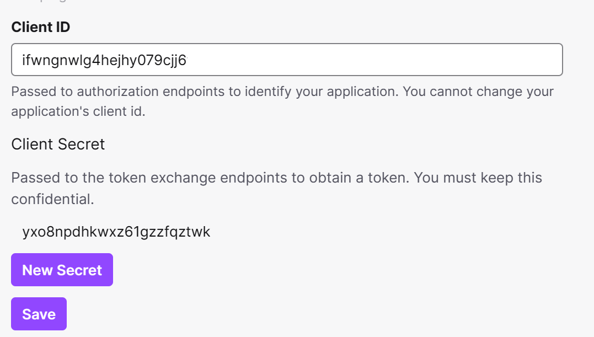
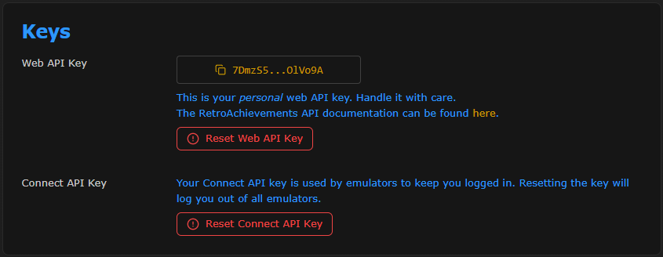

RomM supports multiple metadata providers to enrich your game library with titles, descriptions, cover art, and achievements. You don't need all providers, so this guide covers [popular combos](#popular-combos) and [setup instructions](#setup-instructions).

## Popular combos

Here are some combinations you can use based on your needs:

#### ⭐ The Chef's Choice: [Hasheous](#hasheous) + [ScreenScraper](#screenscraper)  + [Retroachievements](#retroachievements)
- Supports 135+. popular systems
- Hasheous provides hash-based matching and proxies IGDB data (titles, descriptions and artwork)
- ScreenScraper adds additional screenshots and manuals
- Retroachievements provides achievement progress
- **This is the recommended setup for most users**

#### The Twitch Fanboy: [IGDB](#igdb) + [PlayMatch](#playmatch)
- Supports the 200+ systems available on IGDB
- Provides titles, descriptions, cover art and related games from IGDB
- PlayMatch adds hash-based matching for unmatched files
- **Use this if you want a single-provider solution**

#### The French Connection: [ScreenScraper](#screenscraper) + [SteamGridDB](#steamgriddb) + [Retroachievements](#retroachievements)
- Supports 125+ popular systems
- ScreenScraper provides titles, descriptions, cover art, screenshots and manuals
- SteamGridDB provides high-quality fallback cover art
- Retroachievements provides achievement progress
- **Use this if you want to avoid Twitch/Amazon products**

#### The Quick Starter: [Hasheous](#hasheous)
- Hash-based matching only ⚠️
- Proxies titles, descriptions and cover art from IGDB
- Incredibly fast scan times
- **For users who want to avoid API keys**

#### The LaunchBoxer: [LaunchBox](#launchbox)
- Exact filename matching only ⚠️
- Makes no API calls to cloud services
- LaunchBox provides titles, descriptions, and cover art
- **Ideal for LaunchBox users with correct filenames**

## Setup instructions

### IGDB

[IGDB](https://www.igdb.com/) (Internet Game Database) is a popular metadata provider that offers metadata, cover art, screenshots, related games and more.

To access the IGDB API you'll need a Twitch account and a valid phone number for 2FA verification. Up-to-date instructions are available in the [IGDB API documentation](https://api-docs.igdb.com/#account-creation). When registering your application in the Twitch Developer Portal, fill out the form like so:

- Name: Something **unique or random** like `romm-3fca6fd7f94dea4a05d029f654c0c44b` or `KVV8NDXMSRFJ2MRNPNRSL7GQT`
- OAuth Redirect URLs: `localhost`
- Category: `Application Integration`
- Client Type: `Confidential`

<!-- prettier-ignore -->
!!! important  
    The name you pick has to be unique! Picking an existing name will fail silently, with no error messages. We recommend using `romm-<random hash>`, like `romm-3fca6fd7f94dea4a05d029f654c0c44b`

Note the client ID and secret that appear on screen, and use them to set `IGDB_CLIENT_ID` and `IGDB_CLIENT_SECRET` in your environment variables.

<!-- prettier-ignore -->
??? Screenshots
    
    

### ScreenScraper

[ScreenScraper.fr](https://screenscraper.fr/) is a French provider that offers metadata, cover art, screenshots and manuals. It supports a wide range of systems and is a great alternative to IGDB.

To access the ScreenScraper API, create a [ScreenScraper](https://www.screenscraper.fr/membreinscription.php) account and copy the **user** and **password** you just created to `SCREENSCRAPER_USER` and `SCREENSCRAPER_PASSWORD` respectively.

### MobyGames

MobyGames is a metadata provider that offers medatada, cover art and screenshots.

To access the MobyGames API, [create a MobyGames account](https://www.mobygames.com/user/register/) and then visit your profile page. Click the **API** link under your user name to sign up for an API key. Copy the key shown and use it to set `MOBYGAMES_API_KEY`.

<!-- prettier-ignore -->
!!! important
    Access to the MobyGames API is now a [paid feature](https://www.mobygames.com/info/api/#non-commercial). While we will continue to support it, we recommend using [ScreenScraper](#screenscraper) or [Hasheous](#hasheous) instead, as they are free to use.

### LaunchBox

The [LaunchBox](https://gamesdb.launchbox-app.com) Games Database is a community-driven database that provides metadata, cover art, and screenshots. Like the Launchbox desktop application, RomM downloads the entire database locally and matches games based on their exact filenames.

To enable LaunchBox, set `LAUNCHBOX_API_ENABLED=true` in your environment variables. You can enable regular updates of the database by setting `ENABLE_SCHEDULED_UPDATE_LAUNCHBOX_METADATA`, and set the frequency on the cron job with `SCHEDULED_UPDATE_LAUNCHBOX_METADATA_CRON` (defaults to 5:00 AM every day).

### Hasheous

[Hasheous](https://hasheous.org/) is a free, open-source metadata provider that uses file hashes to match games. It proxies IGDB data for titles, descriptions, and cover art, and can provide Retroachievements IDs for matched games.

Simply set `HASHEOUS_API_ENABLED=true` in your environment variables, and future scans will start using the [Hasheous API](https://hasheous.org/swagger/index.html).

### PlayMatch

[Playmatch](https://github.com/RetroRealm/playmatch) is a project built and hosted by a member of our comminuty. It provides a hash-based matching service for, and is used in conjunction with, IGDB.

To enable PlayMatch, set `PLAYMATCH_API_ENABLED=true` in your environment variables.

### SteamGridDB

SteamGridDB provides custom cover art for games or collections. It's not accessed through the scanner but from the "search cover" button when manually editing a game.

To access steamGridDB API, you need to login into their [website](https://www.steamgriddb.com/) with a [steam account](https://store.steampowered.com/join). Once logged in, go to your [API tab under the preferences page](https://www.steamgriddb.com/profile/preferences/api). Copy the key shown and use it to set `STEAMGRIDDB_API_KEY`.

### Retroachievements

RomM is able to display your achievements from [Retroachievements](https://retroachievements.org/). To sync it with your RomM instance, you need to generate an API key from your Retroechievements account in your [settings](https://retroachievements.org/settings)

Copy the key shown and use it to set `RETROACHIEVEMENTS_API_KEY` and perform a partial scan targeting the platform you want to match with Retroachievements.

After that, each user need to set their own username in their profile and sync it with Retroachievements. A new ``Achievements`` tab will appear in the `Personal` tab in the game details.

To avoid unneccessary API calls, a cached file with the RA database is stored in RomM. Refresh time for that cache file can be changed with the env variable `REFRESH_RETROACHIEVEMENTS_CACHE_DAYS`

<!-- prettier-ignore -->
??? Screenshots
    
    
