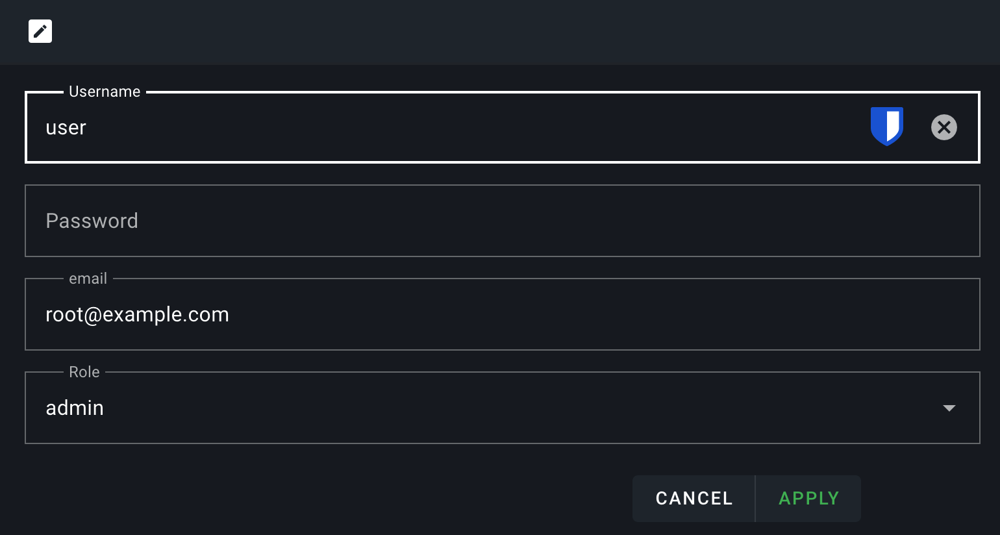
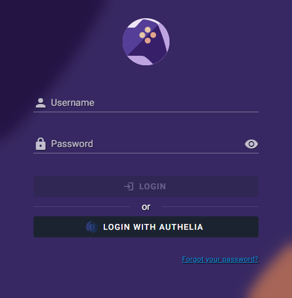

# OIDC Setup With Authelia

## A quick rundown of the technologies

### What is Authelia?

Authelia is an open-source authentication and authorization server providing two-factor authentication and single sign-on (SSO) for your applications via a web portal. It acts as a companion for reverse proxies by allowing, denying, or redirecting requests. Authelia can be deployed alongside your other services to centralize identity management.

### What is OAuth2?

OAuth2 (Open Authorization 2.0) is an industry-standard protocol for authorization. It allows applications (clients) to gain limited access to user accounts on an HTTP service without sharing the user’s credentials. Instead, it uses access tokens to facilitate secure interactions. OAuth2 is commonly used in scenarios where users need to authenticate via a third-party service.

### What is OpenID Connect (OIDC)?

OIDC (OpenID Connect) is an identity layer built on top of OAuth2. While OAuth2 primarily handles authorization, OIDC adds authentication, enabling applications to verify a user’s identity and obtain profile information. This makes OIDC suitable for SSO solutions, where user identity is central to access management.

## Setting up a Provider and Application in Authelia

### Step 1: Install and Configure Authelia

Before setting up a provider and app, ensure that Authelia is installed and running by following the [getting started](https://www.authelia.com/integration/prologue/get-started/) and [OIDC provider](https://www.authelia.com/configuration/identity-providers/openid-connect/provider/) guides.

### Step 2: Add a client

First, in Authelia's `configuration.yml`, at `identity_providers` → `oidc` → `claims_policies` you'll need to add a Claims Policy if you do not already have one with the specified claims:
```yaml
# identity_providers:
#   oidc:
claims_policies:
  with_email: # You can name this however you want
    id_token: ['email', 'email_verified', 'alt_emails', 'preferred_username', 'name']
```

To read more about claims_policies and why you need it for RomM, see [this section in the Authelia docs](https://www.authelia.com/integration/openid-connect/openid-connect-1.0-claims/#restore-functionality-prior-to-claims-parameter). 

Then, in the same `configuration.yml`, under `identity_providers` → `oidc` → `clients`, add a new entry:

- A **random** `client_id` and `client_secret`
    - See the [official recommendations](https://www.authelia.com/integration/openid-connect/frequently-asked-questions/#how-do-i-generate-a-client-identifier-or-client-secret) on how to generate these.
- `public` should be set to `false`.
- `redirect_uris` should include your RomM instance's URL + `/api/oauth/openid` (e.g., `http://romm.host.local/api/oauth/openid`).
- `claims_policy` is the name of the entry at claims_policies that you just added (or already had).
- `scopes` includes `openid`, `email` and `profile`.
- `token_endpoint_auth_method` should be set to `client_secret_basic`.
- `userinfo_signed_response_alg` should be set to `none`.

Refer to the [official docs](https://www.authelia.com/configuration/identity-providers/openid-connect/clients/) for more details.

This entry should look like this:

```yaml
#identity_providers:
#  oidc:
#    clients:
- client_id: "<randomly_generated>" # read above for how generate
  client_name: "RomM" # will be displayed in Authelia to users
  client_secret: "$pbkdf2-sha512$randomly_generated" # read above for how generate
  public: false
  authorization_policy: "two_factor" # or one_factor, depending on your needs
  grant_types:
      - authorization_code
  redirect_uris:
      - "http://romm.host.local/api/oauth/openid"
  claims_policy: 'with_email'
  scopes:
      - "openid"
      - "email"
      - "profile"
  userinfo_signed_response_alg: "none"
  token_endpoint_auth_method: "client_secret_basic"
```

### Step 3: Configure RomM Environment Variables

To enable OIDC authentication in RomM, you need to set the following environment variables:

- `OIDC_ENABLED`: Set to `true` to enable OIDC authentication.
- `OIDC_PROVIDER`: The lowercase name of the provider (`authelia`).
- `OIDC_CLIENT_ID`: The client ID copied from the Authelia application.
- `OIDC_CLIENT_SECRET`: The generated output from `Random Password`.
- `OIDC_REDIRECT_URI`: The redirect URI configured in the Authelia provider, in the format `http://romm.host.local/api/oauth/openid`.
- `OIDC_SERVER_APPLICATION_URL`: The base URL for you Authelia instance, e.g. `http://authelia.host.local`.

### Step 4: Set your Email in RomM

In RomM, open your user profile and set your email address. This email **has to match** your user email in Authelia.



### Step 5: Test the Integration

After configuring the environment variables, restart (or stop and remove) your RomM instance and navigate to the login page. You should see an option to log in using OIDC. Click on the OIDC button, and you'll be redirected to Authelia for authentication. Once authenticated, you'll be redirected back to RomM.


