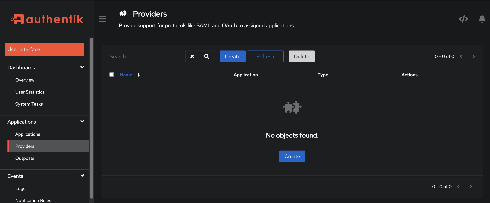
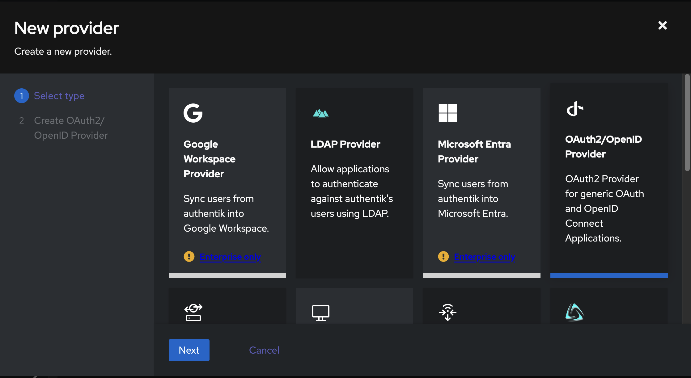
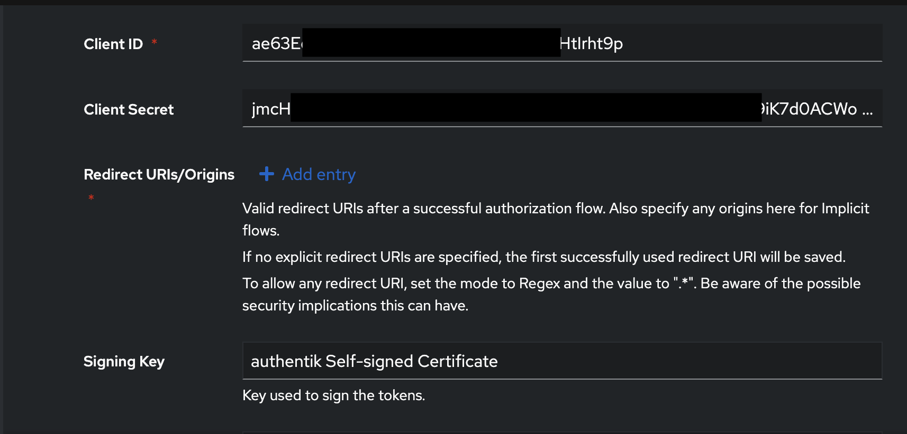
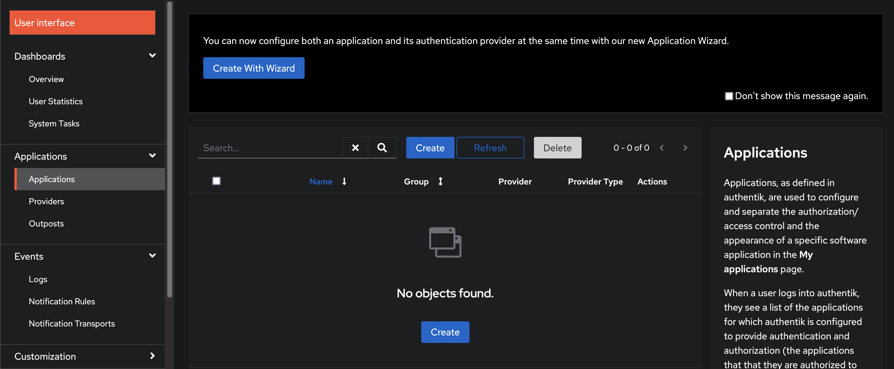
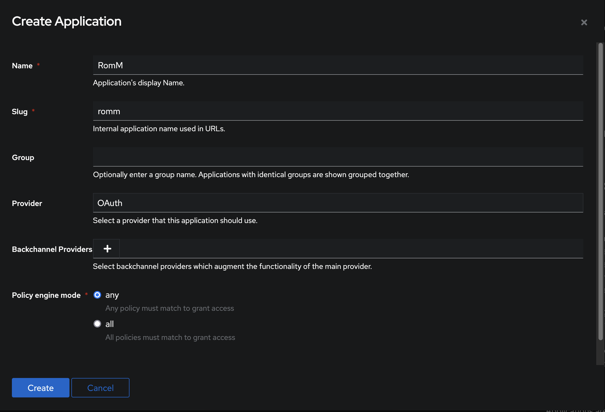

# OIDC Setup With Authentik

## A quick rundown of the technologies

### What is Authentik?

Authentik is an open-source identity provider (IdP) designed to manage authentication, authorization, and user management across applications. It supports modern authentication protocols and provides tools to simplify integration, including single sign-on (SSO), multi-factor authentication (MFA), and auditing capabilities. Authentik can be deployed alongside your other services to centralize identity management.

### What is OAuth2?

OAuth2 (Open Authorization 2.0) is an industry-standard protocol for authorization. It allows applications (clients) to gain limited access to user accounts on an HTTP service without sharing the user’s credentials. Instead, it uses access tokens to facilitate secure interactions. OAuth2 is commonly used in scenarios where users need to authenticate via a third-party service.

### What is OpenID Connect (OIDC)?

OIDC (OpenID Connect) is an identity layer built on top of OAuth2. While OAuth2 primarily handles authorization, OIDC adds authentication, enabling applications to verify a user’s identity and obtain profile information. This makes OIDC suitable for SSO solutions, where user identity is central to access management.

## Setting up a Provider and Application in Authentik

### Step 1: Install and Configure Authentik

Before setting up a provider and app, ensure that Authentik is installed and running by following the [official installation guide.](https://docs.goauthentik.io/docs/install-config/install/docker-compose).

1. Access Authentik via its web interface.
2. Log in as an administrator.
3. Navigate to the “Admin Interface” to configure the necessary components.

### Step 2: Create a Provider

A provider in Authentik acts as the bridge between RomM and Authentik.

1. **Navigate to Providers**:
    - Go to the "Providers" section in the Authentik admin interface.
2. **Create a New Provider**:
    - Click on “Create” and choose the protocol (e.g., “OIDC Provider”).
      
3. **Select "OAuth2/OpenID Provider"**
   
4. **Configure Provider Settings**:
    - **Name**: Assign a unique name to the provider (e.g., "RomM OIDC Provider").
    - **Authorization flow**: Select **implicit consent**.
    - **Redirect URIs**: Add your RomM instance's URL + `/api/oauth/openid` (e.g., `http://romm.host.local/api/oauth/openid`).
5. **Copy the Client ID and Secret**:
    - You'll need these to set `OIDC_CLIENT_ID` and `OIDC_CLIENT_SECRET` in your RomM instance.
      
6. **Click Create**.

### Step 3: Register an Application

An app in Authentik represents the external service (in our case RomM) that will use the provider for authentication.

1. **Navigate to Applications**:
    - Go to the "Applications" section in the admin interface.
      
2. **Create a New Application**:
    - Click on “Create” and configure the app settings: - **Name**: Provide a recognizable name (e.g., "RomM"). - **Slug**: Create a unique identifier for the app (e.g., "romm"). - **Provider**: Link the app to the previously created provider, "RomM OIDC Provider".
      
3. **Click Create**.

### Step 4: Configure RomM Environment Variables

To enable OIDC authentication in RomM, you need to set the following environment variables:

- `OIDC_ENABLED`: Set to `true` to enable OIDC authentication.
- `OIDC_PROVIDER`: The lowercase name of the provider (`authentik`).
- `OIDC_CLIENT_ID`: The client ID copied from the Authentik application.
- `OIDC_CLIENT_SECRET`: The client secret copied from the Authentik application.
- `OIDC_REDIRECT_URI`: The redirect URI configured in the Authentik provider, in the format `http://romm.host.local/api/oauth/openid`.
- `OIDC_SERVER_APPLICATION_URL`: The URL of the Authentik application, e.g., `http://authentik.host.local/application/o/romm`.

### Step 5: Set your Email in RomM

In RomM, open your user profile and set your email address. This email **has to match** your user email in Authentik.

### Step 6: Test the Integration

After configuring the environment variables, restart (or stop and remove) your RomM instance and navigate to the login page. You should see an option to log in using OIDC. Click on the OIDC button, and you'll be redirected to Authentik for authentication. Once authenticated, you'll be redirected back to RomM.

