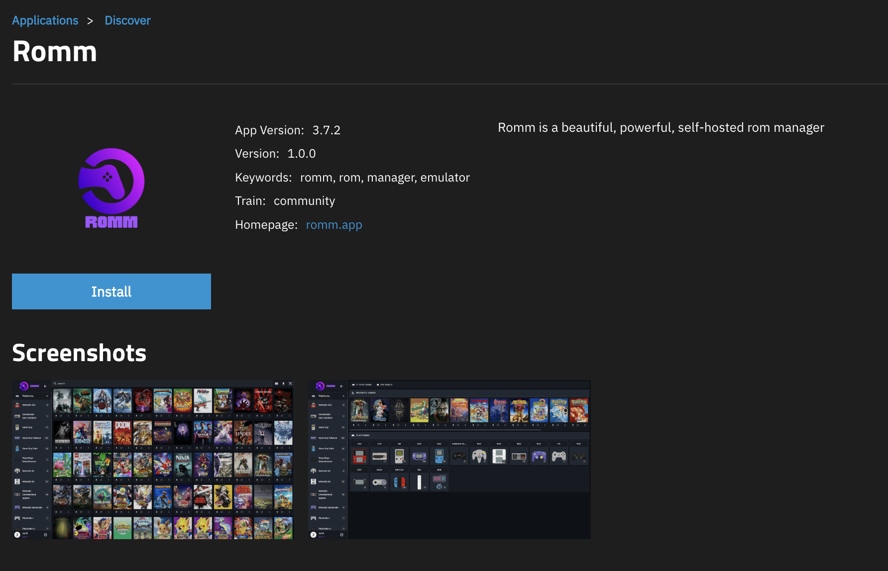
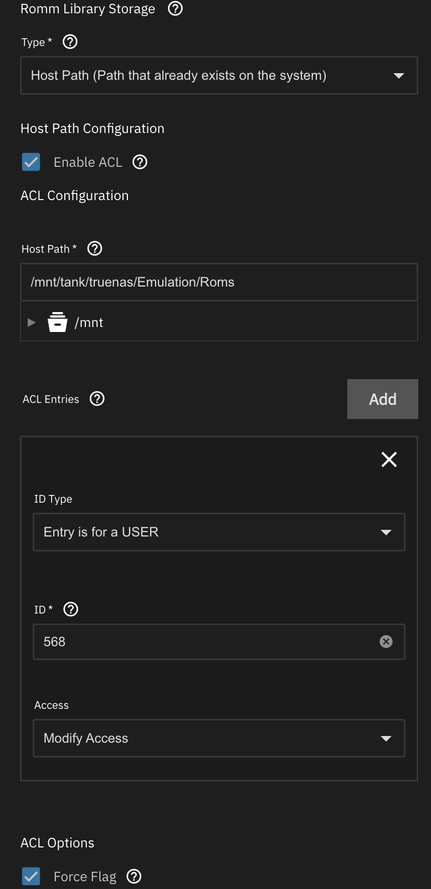

<!-- trunk-ignore-all(markdownlint/MD041) -->

## Prerequisites

This guide assumes you're familiar with Docker and have basic knowledge of TrueNAS. You'll need:

- A running TrueNAS installation
- Your games setup in the [required folder structure](https://github.com/rommapp/romm/blob/release/README.md)

## Setup Process

### Install through the TrueNAS App Catalog (Recommended)

#### Step 1: Navigate to RomM app

Navigate to the App Catalog via Apps (Left navigation bar) -> Discover Apps -> RomM -> Install



#### Step 2: Installation configuration

Step through the installation UI. You will need to supply various credentials per the [Quick Start Guide](../Getting-Started/Quick-Start-Guide.md). Most of the default values will work.

Note: You will likely want to set certain Storage Configurations to a Dataset within TrueNAS, such as your RomM Library and Assets storage. If you do this, ensure you provide ACL access to the UserID specified above (default: 568, apps user).



#### Step 3: Save your configuration

Save, and you're done! If the app will not boot, refer to [Troubleshooting](#troubleshooting) or head on over to the [Discord](https://discord.gg/P5HtHnhUDH).

### Install via YAML

This installation path should only be used in the event that there is a bug with installing through the App Catalog, or you wish to have more flexibility than is provided by the installation UI.

#### Step 1: Navigate to YAML install

Navigate to the `Install via YAML` page via Apps (Left navigation bar) -> Discover Apps -> Install via YAML


#### Step 2: Paste in the following YML

Replace any empty values with credentials you've created per the [Quick Start Guide](../Getting-Started/Quick-Start-Guide.md).

<!-- prettier-ignore -->
???+ example "Example Docker Compose"
    ``` yaml
    --8<-- "truenas.docker-compose.yml"
    ```

#### Step 3: Save the configuration

Save, and you're done! If the app will not boot, refer to [Troubleshooting](#troubleshooting) or head on over to the [Discord](https://discord.gg/P5HtHnhUDH).

## Troubleshooting

### General

- Ensure you have replaced empty values (UIDs, GIDs, passwords, API keys) with your own
- Ensure proper permissions are applied within TrueNAS
- Monitor logs via the app bash terminal during for any errors if the app is encountering issues

### Specific Issues

#### Permissions issues inside the docker image

If you are encountering permissions issues with folders internal to the docker image (not your TrueNAS dataset), consider temporarily setting the user to root (user: 0). If you do this, it is recommended you fix local file permissions via shell and return access back to a non-root user.

In my particular setup, I had to create a user/group in TrueNAS with uid:gid of 1000:1000 and auxiliary group `apps` due to hard-coded values in the RomM docker image. This resolved outstanding issues I had with my instance of RomM talking to its Redis instance.

## Contributing

If you have any suggestions or improvements, please submit a pull request to the [RomM wiki](https://github.com/rommapp/wiki).
