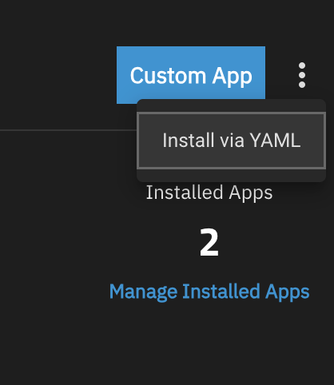
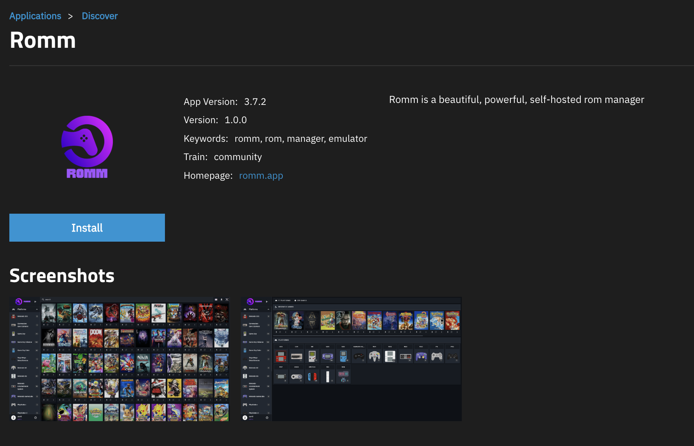
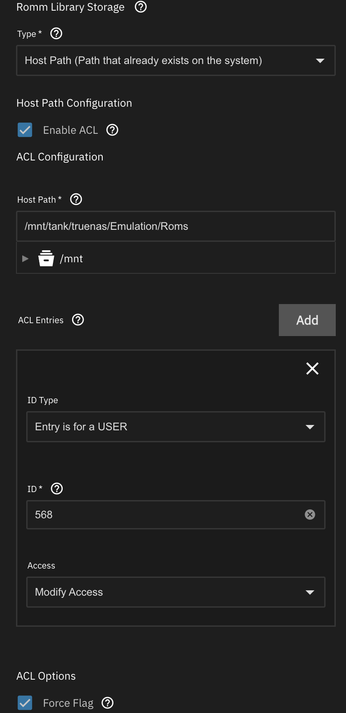

# TrueNAS Setup Guide

## Prerequisites
This guide assumes you're familiar with Docker and have basic knowledge of TrueNAS. You'll need:
- A TrueNAS installation
- A [Romm Folder structure](https://github.com/rommapp/romm/blob/release/README.md)

## Setup Process

**Note:** There is currently an [open bug](https://github.com/truenas/apps/issues/1405) with the built-in Romm app for TrueNAS. Therefore, the recommended path at this time for a working installation is through custom YAML.

### Install via YAML (Recommended as of 2025-01-21)

#### Step 1: Navigate to YAML install
Navigate to the `Install via YAML` page via Apps (Left Navbar) -> Discover Apps -> Install via YAML



#### Step 2: Paste in the following YML

Replace any empty values with credentials you've created per the [Quick Start Guide](quick-start-guide).

```yaml
services:
  romm:
    container_name: romm
    depends_on:
      romm-db:
        condition: service_healthy
        restart: True
    deploy:
      resources: # Resource constraints
        limits:
          cpus: '2.0'
          memory: 4g
    environment:
      - DB_HOST=romm-db
      - DB_NAME=romm
      - DB_USER=romm-user
      - DB_PASSWD= # Should match MARIADB_PASSWORD in mariadb
      - ROMM_AUTH_SECRET_KEY= # Generate a key with `openssl rand -hex 32`
      - IGDB_CLIENT_ID= # Generate an ID and SECRET in IGDB
      - IGDB_CLIENT_SECRET= # https://api-docs.igdb.com/#account-creation
      - MOBYGAMES_API_KEY= # https://www.mobygames.com/info/api/
      - STEAMGRIDDB_API_KEY= # https://github.com/rommapp/romm/wiki/Generate-API-Keys#steamgriddb
    image: rommapp/romm:latest
    ports:
      - '31100:8080'
    restart: unless-stopped
    user: '568:568'
    volumes: # Any /mnt paths may optionally be replaced with a docker volume
      - /mnt/tank/truenas/resources:/romm/resources # Replace /mnt...: file path with your own data structure
      - romm_redis_data:/romm/redis-data # Docker will manage this volume
      - /mnt/tank/truenas/roms:/romm/library # Replace /mnt...: file path with your own data structure
      - /mnt/tank/truenas/assets:/romm/assets # Replace /mnt...: file path with your own data structure
      - /mnt/tank/truenas/config:/romm/config # Replace /mnt...: file path with your own data structure
  romm-db:
    container_name: romm-db
    environment:
      - MARIADB_ROOT_PASSWORD= # Use a unique, secure password
      - MARIADB_DATABASE=romm
      - MARIADB_USER=romm-user
      - MARIADB_PASSWORD= # Match MARIADB_ROOT_PASSWORD
    healthcheck:
      interval: 10s
      retries: 5
      start_interval: 10s
      start_period: 30s
      test:
        - CMD
        - healthcheck.sh
        - '--connect'
        - '--innodb_initialized'
      timeout: 5s
    image: mariadb:latest
    restart: unless-stopped
    volumes:
      - mysql_data:/var/lib/mysql
version: '3'
volumes:
  mysql_data: Null
  romm_redis_data: Null

```

#### Step 3: Save your configuration

Save, and you're done! If the app will not boot, refer to [Troubleshooting](#troubleshooting) or head on over to the [Discord](https://discord.gg/P5HtHnhUDH).

### Install via through the TrueNAS App Store

#### Step 1: Navigate to Romm app
Navigate to the App Store via Apps (Left Navbar) -> Discover Apps -> Romm -> Install



#### Step 2: Installation configuration
Step through the installation UI. You will need to supply various credentials per the [Quick Start Guide](quick-start-guide). Most of the default values will work.

Note: You will likely want to set certain Storage Configurations to a Dataset within TrueNAS, such as your Romm Library and Assets storage. If you do this, ensure you provide ACL access to the UserID specified above (default: 568, apps user).



#### Step 3: Save your configuration

Save, and you're done! If the app will not boot, refer to [Troubleshooting](#troubleshooting) or head on over to the [Discord](https://discord.gg/P5HtHnhUDH).

## Troubleshooting

### General
- Ensure you have replaced empty values (UIDs, GIDs, passwords, API keys) with your own
- Ensure proper permissions are applied within TrueNAS
- Monitor logs via the app bash terminal during for any errors if the app is encountering issues

### Specific Issues

#### Permissions issues inside the docker image.

If you are encountering permissions issues with folders internal to the docker image (not your TrueNAS dataset), consider temporarily setting the user to root (user: 0). If you do this, it is recommended you fix local file permissions via shell and return access back to a non-root user.

In my particular setup, I had to create a user/group in TrueNAS with uid:gid of 1000:1000 and auxiliary group `apps` due to hard-coded values in the Romm docker image. This resolved outstanding issues I had with my instance of Romm talking to its Redis instance.

## Contributing

If you have any suggestions or improvements, please submit a pull request to the [RomM wiki](https://github.com/rommapp/wiki).
